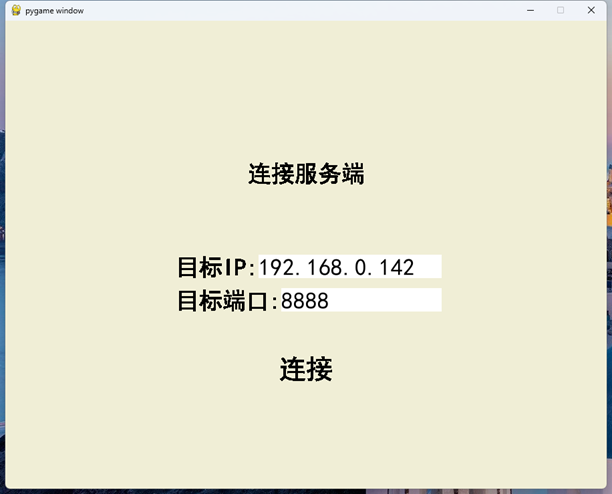
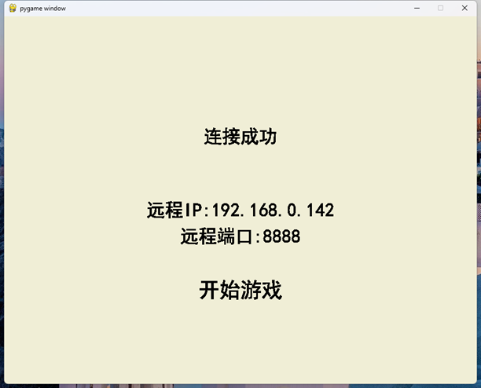
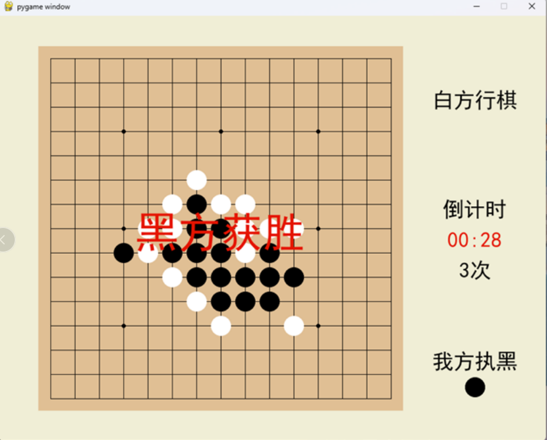

# SocketGobang
基于socket连接的双人五子棋游戏，使用pygame开发，分为客户端与服务端。

python与pygame版本为：
```
python 3.8.1
pygame 2.0.1
```

启动后，在客户端输入服务端的ip和端口进行连接，在双方都确认开始后，正式开始游戏。

客户端1执黑棋，客户端2执白棋，黑棋先行。

任意方向连成5子则获胜。

每回合落子限时30秒，共有3次超时机会，若3次机会耗尽后仍然超时，则判负。







